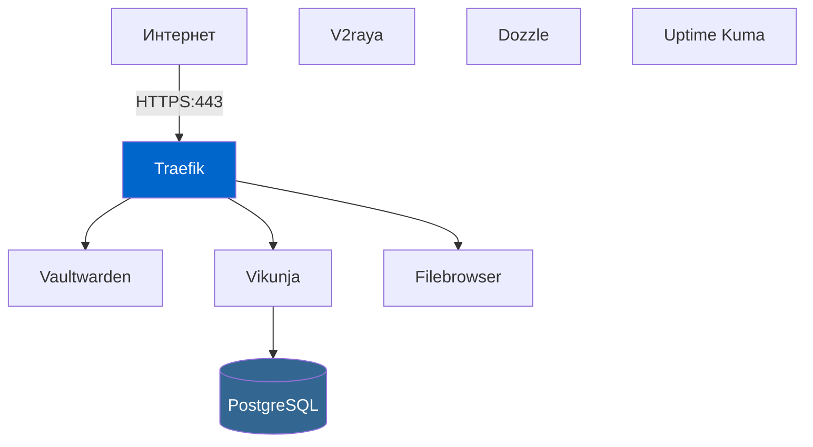

# Self-Hosted Apps

Документация для развертывания и управления набором self-hosted приложений.

## Архитектура системы

## Компоненты

- [v2raya](v2raya/) - VPN/прокси клиент с веб-интерфейсом
- [Vaultwarden](vaultwarden/) - Менеджер паролей
- [Vikunja](vikunja/) - Менеджер задач
- [Filebrowser](filebrowser/) - Веб-файловый менеджер
- [Dozzle](dozzle/) - Просмотрщик логов
- [Traefik](traefik/) - Обратный прокси
- [Uptime Kuma](uptime-kuma/) - Мониторинг
